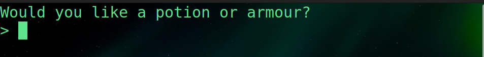

### Wizard Battles

This is a small battle game that works using TCP/IP sockets in python.

To run this project, cd to the backend folder and run the server.

*Note: you may have to use `python` or `python3` instead of `py` in the following commands*

```
py server.py
```

The server should start and will say an IP address, make sure to remember it.

Then on any machine on the same internet connection you can open another terminal and run the game.py file

```
py game.py
```

Now, the client will ask for an IP address.
Type in the IP that the server is running on and it should connect and ask you to name your wizard.
*Note: If you are on the same machine as the one running the server, when prompted for an IP address you can simply hit enter*

To stop the server, simply type `stop` and hit enter in the server terminal.

You can also use `cls` or `clear` to clear the server console.

---

### Playing the game

Once connected you will be prompted to name your wizard and give them a face.

Then you will be prompted with this screen to choose a tier one spell.


The game is played on a 5x5 grid and the spells that are shown tell you how they act on that grid when cast.
They also tell you the damage they deal and the amount of turns they are on cooldown for.

Then the game asks you to choose a tier two spell


You'll notice that one of the spells doesn't show a little smiley face and instead of relative at the top it says **Full Column**.
This means instead of the spell being cast from your wizards position the spell is cast on a full column, but be careful if you are in range you will be hit too!

Then the game asks you to choose a tier three spell


*Note: The spells that show up are randomly selected and there are many to choose from, for Ex.*


*Note: these spells are Static, which means that the range they show will always be the case, the spell when cast will always hit the tiles indicated*

Finally before battling the game asks if you would like to have a potion, which will heal health, or armour, which starts you with more health so be strategic in your choice.



Now our wizard is all equipped and ready to enter the battle queue. This is where we will wait for an opponent.


Once someone else enters the queue you will be matched up!


You can see that as Harry I can cast any spell not on cooldown, use my potion, move in a valid direction, right or up in this case, or simply pass my turn.

The battle is over once someone is out of health. If you win you will re-enter the battle queue with your victorious wizard, fully healed of course. Losing means your wizard has fallen and you will be prompted to create a new one. 

*Protip: movement always happens before spells get cast, that makes knowing the patterns of your opponents spells very useful*


